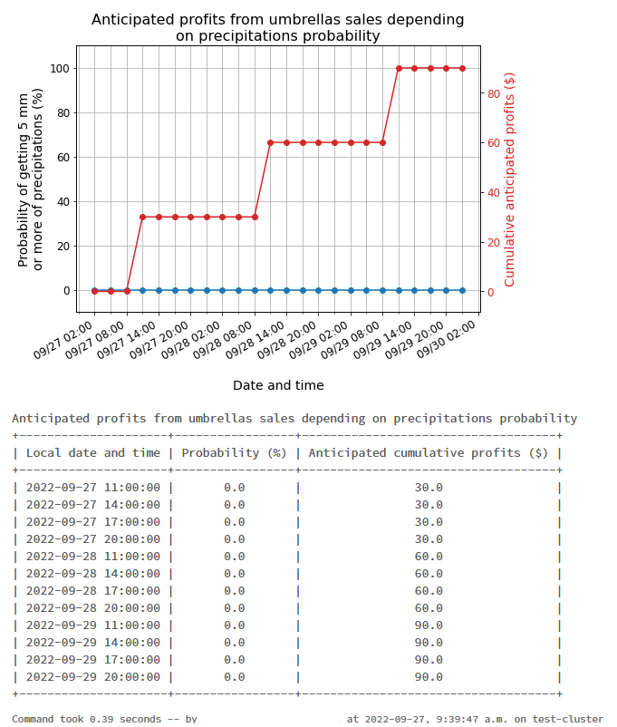
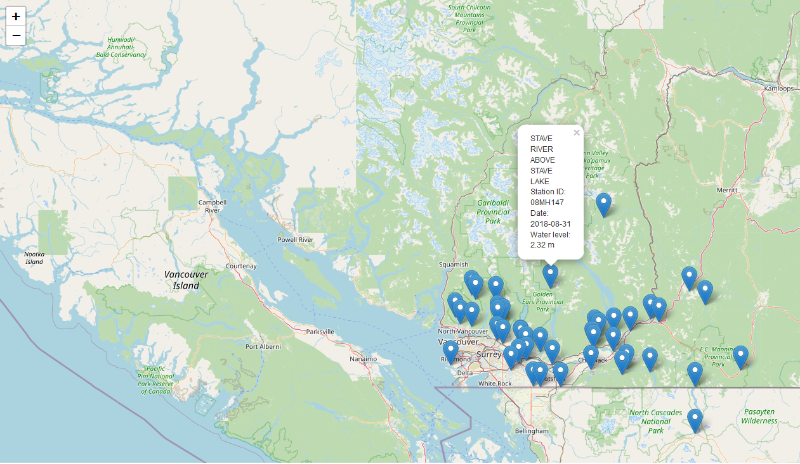

# Geospatial Pipeline Evaluation
- [**Scaling Geospatial Work in Databricks**](#scaling-geospatial-work-in-databricks)
- [**MSC**](#msc)
  - [**WMS-API**](#wms)
    - [**Performance**](#performance)  
  - [**OGC-API**](#ogc)
    - [**Performance**](#performance-1) 
    - [**Difficulties**](#difficulties) 
  - [**Work To Do**](#work-to-do)
    - [**Optimization Ideas**](#optimization-ideas)
- [**RADARSAT1**](#radarsat1)

## **Scaling Geospatial Work in Databricks**
To best utilize the Databricks environment, is to use spark and the advantages that come along with it. Here are a few examples of how Geospatial workflows can be optimized and what we have successfully implemented thus far.
* The first way to efficiently implement geospatial workflows in databricks is through libraries that extend spark into geospatial work.
  * Many of these libraries are Scala and 
* Another way of efficiently using Databricks environment is by using user defined functions on spark dataframes and delta tables.
  * This was successfully implemented, however most of these benefits only become identifiable in large datasets
* Grid systems such as S2 and GeoHex divide spatial date into grids to better preform parallel computation.
  * not yet implemented

## **MSC**
 ECCC provides the Meteorological Service of Canada along with open data. This information can be found [**here**](https://eccc-msc.github.io/open-data/readme_en/). 
 
### **WMS**
#### **Profits based on precipitation:**

*   This was a use case was an example provided by the MSC open data portal [**here**](https://eccc-msc.github.io/open-data/usage/use-case_arthur/use-case_arthur_en/). This pipeline uses [**Web Map Services (WMS)**](https://eccc-msc.github.io/open-data/msc-geomet/web-services_en/#web-map-service-wms) and uses temporal queries to display calculated results in multiple formats. 
*   We were able to directly implement [**the script**](https://github.com/ssc-sp/geospatial-pipeline-eval/blob/main/MSC_Pipelines/MSC_precipitation_UseCase.py) into the databricks environment. To fully utlilze databricks, it is recommended that the data be placed within spark dataframes rather than pandas so that spark may run parallel jobs.
##### **Performance:**
* The way the original script was set up, allowed for no improvments in performance even after the movement into dsitributed spark dataframe

### **OGC**
#### **Retrieving and displaying hydrometric data:**

* This was a use case was an example provided by the MSC open data portal [**here**](https://eccc-msc.github.io/open-data/usage/use-case_oafeat/use-case_oafeat-script_en/5). This pipeline uses the [**GeoMet-OGC-API**](https://api.weather.gc.ca/) which leverages vector data in GeoJSON format using Open Geospatial Consortium standards. 
* [**This script**](https://github.com/ssc-sp/geospatial-pipeline-eval/blob/main/MSC_Pipelines/MSC_Hydrometric_UseCase.py) was implemented in the databricks environment
##### **Performance:**
* The perfomance of the spark dataframes were much slower than the original code both run in the same environment
  * This is due to the original script gave each station a separate dataframe meaning the splitting up of the already small dataframes are unessecary
  * It was also difficult to fully test the performance on this script since only two parts fully utilize the dataset
  * Look to [**Optimization Ideas**](#optimization-ideas) for how we could optimize performance
##### **Difficulties:**
*  We ran into problems resolving dependencies with the mapping library cartopy. Specifically, the GEOS library. While this may be fixable in the environment the [**folium**](http://python-visualization.github.io/folium/) library to map the resulting data.
  * The folium library uses the leaflet.js library and can be easily implemented using python web development tools such as flask and django (example can be found [**here**](http://python-visualization.github.io/folium/flask.html))
    *  This means that web mapping [**examples**](https://eccc-msc.github.io/open-data/usage/tutorial_web-maps_en/#tutorial-building-interactive-web-maps-with-openlayers-and-leaflet) provided by ECCC can also be implemented in databricks
*  Due to the original script which split up the data into stations with a dataframe for each station, spark underpreformed compared to the original script which was built for a single node
    * This will be a common issue with moving scripts into the spark environment and something we will have to think about to effectively use Databricks

#### **Testing Sparks Dataframe:**
* This script is an example of how the databricks environment can be efficiently implemented in a way that maximizes it's benefits
* We used the GeoMet API and delta tables to implement spark jobs to demonstrate the strengths of Databricks and spark
* While comparing Pandas dataframes and spark delta tables, the spark methods of splitting, operating and joining together made runtimes longer for small files of less than 500,000 records
  * However this can be tested on larger datasets with UDFs to test runtime differences  

### **Work To Do**
* Optimize scripts using spark dataframes and delta tables
* Better test performance by using larger dataset
* Find a way to implement cartopy for mapping of 
  * The required step here is to install [**LibGEOS**](https://libgeos.org/) onto the cluster or the notebook
#### **Optimization Ideas**
* Implement all stations as a single dataframe
* Store API items in a delta lake table
* Decrease the shuffle partition size
  * increased runtime sql queries around 65%
  
## **RADARSAT1**
Using the Canadian Space Agencies Repo, scripts where moved in a Databricks environment to demonstrate RADARSAT-1 satetlite imagery. More details of this project can be found [**here**](https://github.com/ssc-sp/radarsat1-scripts).

