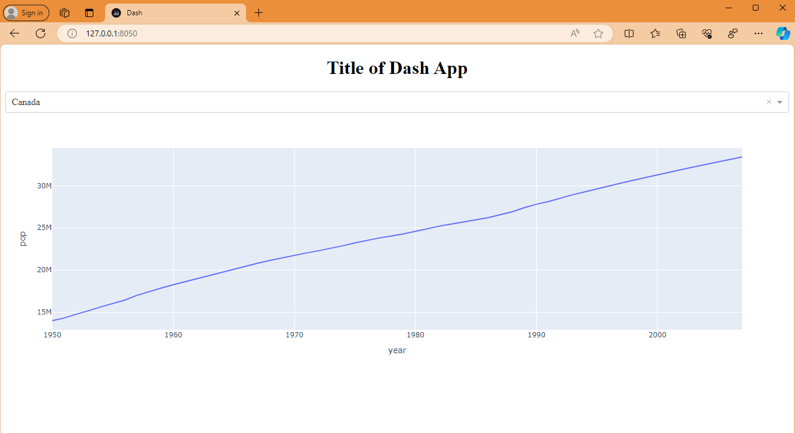

# Demo for Python Dash

- Based on [__Minimal Dash App__](https://dash.plotly.com/minimal-app)

## Instructions

1. Open your terminal.

2. Navigate to the directory where you want to clone the repository. For example, if you want to clone it into a directory called "projects", you would use the following command:
    ```bash
    cd /path/to/projects
    ```

3. Clone the repository. You'll need the URL of the repository to do this. Replace `url_to_repository` with the actual URL:
    ```bash
    git clone https://github.com/ssc-sp/datahub-demos
    ```

4. Navigate into the cloned repository:
    ```bash
    cd datahub-demos
    ```

5. Install the required Python packages. According to the README, you need Dash and Pandas. You can install them with pip:
    ```bash
    pip install dash pandas
    ```

6. Run the application. According to the README, the main file is `minimal.py`:
    ```bash
    python minimal.py
    ```

7. Application should output the following
    ```bash
    Dash is running on http://127.0.0.1:8050/

    * Serving Flask app 'minimal'
    * Debug mode: on
    ```
7. Open browser on http://127.0.0.1:8050/

    